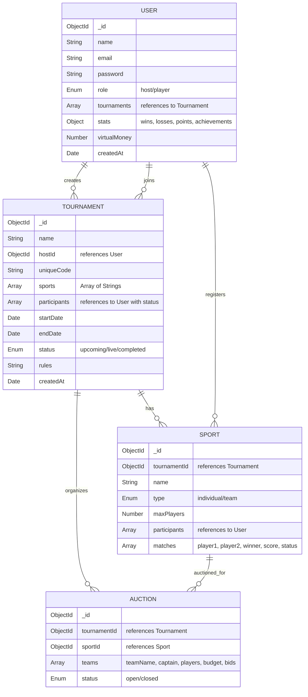

```mermaid
erDiagram
    USER {
        ObjectId _id
        String name
        String email
        String password
        Enum role "host/player"
        Array tournaments "references to Tournament"
        Object stats "wins, losses, points, achievements"
        Number virtualMoney
        Date createdAt
    }

    TOURNAMENT {
        ObjectId _id
        String name
        ObjectId hostId "references User"
        String uniqueCode
        Array sports "Array of Strings"
        Array participants "references to User with status"
        Date startDate
        Date endDate
        Enum status "upcoming/live/completed"
        String rules
        Date createdAt
    }

    SPORT {
        ObjectId _id
        ObjectId tournamentId "references Tournament"
        String name
        Enum type "individual/team"
        Number maxPlayers
        Array participants "references to User"
        Array matches "player1, player2, winner, score, status"
    }

    AUCTION {
        ObjectId _id
        ObjectId tournamentId "references Tournament"
        ObjectId sportId "references Sport"
        Array teams "teamName, captain, players, budget, bids"
        Enum status "open/closed"
    }

    USER ||--o{ TOURNAMENT : creates
    USER ||--o{ TOURNAMENT : joins
    TOURNAMENT ||--o{ SPORT : has
    TOURNAMENT ||--o{ AUCTION : organizes
    SPORT ||--o{ AUCTION : auctioned_for
    USER ||--o{ SPORT : registers
```
